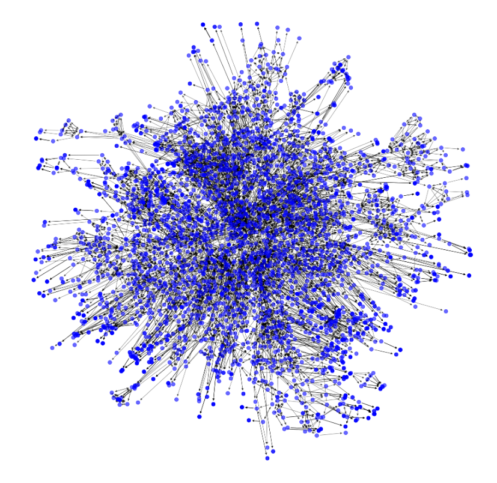
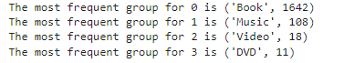
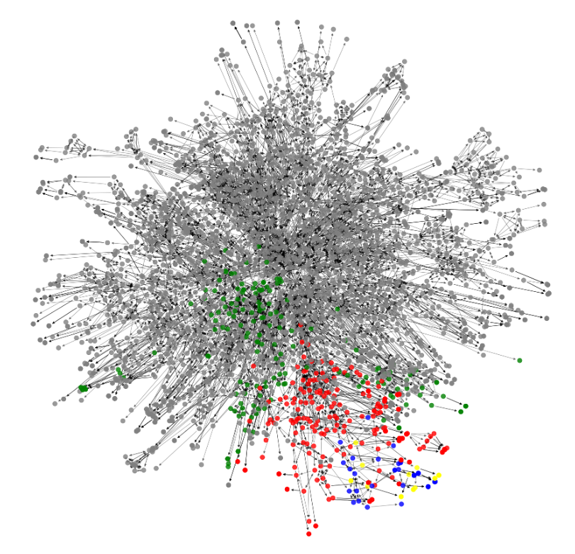

# Amazon Product Co-Purchasing Network Analysis

## Overview

This project delves into the Amazon Product Co-Purchasing Network using a dataset from the Stanford Large Network Dataset Collection (SNAP). Our aim was to reproduce findings from the study "The Dynamics of Viral Marketing" by J. Leskovec, L. Adamic, and B. Adamic, while exploring additional insights into the sub-communities within the network. This involves preprocessing the data, analyzing network statistics, identifying community structures, and attempting to create a product recommendation system.

## Dataset Description

The dataset comprises over 548,551 unique products with metadata and co-purchase information as of 2003 and 2006. It includes product IDs, titles, groups (e.g., books, music), sales ranks, similar product lists, and customer reviews.

## Tools and Technologies

- **Python:** Main programming language used for data manipulation and analysis.
- **NetworkX:** Library used for network analysis tasks.
- **Matplotlib:** Library used for generating graphical representations of the data.
- **Pandas:** Library used for data manipulation and analysis.

## Project Structure

1. **Data Preprocessing:** Conversion of raw data into a format suitable for analysis.
2. **Data Sampling:** Due to the massive size of the dataset, we sampled a subset of connections for manageable processing.
3. **Network Analysis:** Construction and analysis of the graph representing product co-purchases.
4. **Community Detection:** Identification of primary and sub-communities using the Girvan-Newman algorithm.
5. **Recommendation System (Prototype):** Development of a basic product recommendation system based on co-purchase data.

## Results

We analyzed the network to find central nodes and communities. While the initial aim was to replicate the findings of the cited paper, we explored further into the dynamics of the network, revealing insights into how products are interconnected. However, challenges arose in the granularity of community detection and the scalability of algorithms used.
#### Here we have the graph of all nodes and edges found within the sub sampled dataset
<div>
  
</div>
#### After Running Newman's Algorithm, we were able to find primary communities within the data
<div>
  
</div>

#### Stats for each community calculated
<div>
  
</div>

#### Exploring Sub communities within primary communities. For more detail see the [python code](https://github.com/Wesam-Hashmeh/Amazon-Products-SNA/blob/main/AmazonSNA.ipynb)!
<div>
  
</div>


## Future Work

Further improvements could include:
- Implementing more efficient community detection algorithms.
- Enhancing the recommendation system with machine learning techniques.
- Expanding the analysis to include more recent data to reflect current market dynamics.

## Contributors

- [Wesam Hashmeh](https://github.com/Wesam-Hashmeh)
- [Zaid Iqbal ](https://github.com/Zaid-Iqbal)

## References

- [SNAP Datasets](https://snap.stanford.edu/data/index.html#amazon)
- [NetworkX Documentation](https://networkx.org/documentation/stable/index.html)
- [Pandas Documentation](https://pandas.pydata.org/pandas-docs/stable/index.html)
- [Matplotlib Documentation](https://matplotlib.org/stable/index.html)

## How to Use

Details on how to setup, run, and use the project for further analysis.

```bash
git clone https://github.com/yourrepository/AmazonNetworkAnalysis.git
cd AmazonNetworkAnalysis
pip install -r requirements.txt
python analysis_script.py
